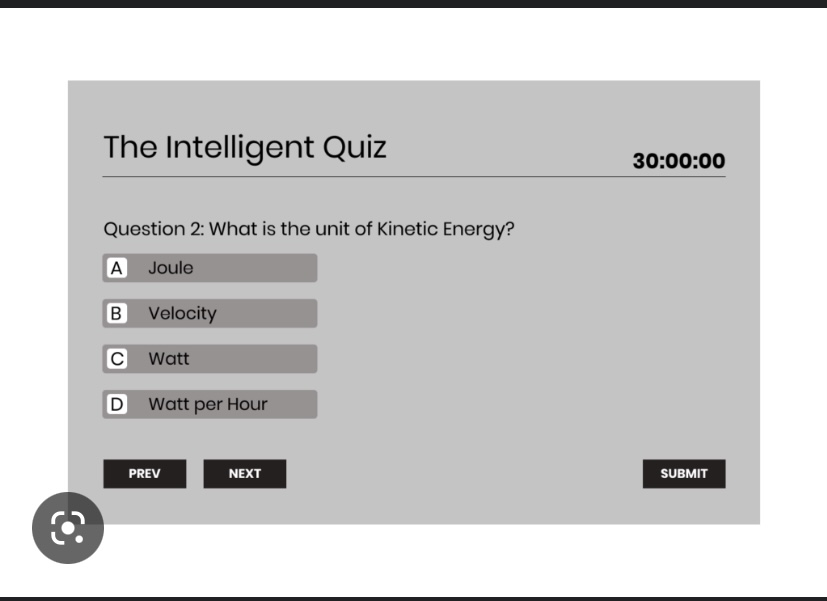

##Description
Challenge invited me to build a timed coding quiz with multiple-choice questions. This app will run in the browser and will feature dynamically updated HTML and CSS powered by JavaScript code that I wrote. It will have a clean, polished, and responsive user interface. Also while being a timed event and keeping the highscores for each user

##Features
-Fun Questions
-Interactive Screen
-Timed Event
-High scores are sorted by highest score

##Usage
Improve my skill set and also get familiar with different styling. Have employers see and understand my code and styling designs. Also to have different people play a interactive game

##Screenshot
The design in which I modeled my work.

##Wireframe
The framing of my design

##Link
file:///Users/abdidaqane/Downloads/Quiz-App-main/quiz%20app/index.html

##License
Abdirahman Daqane
Licence © 2022, LLC, brand. Confidential and Proprietary. All Rights Reserved.

